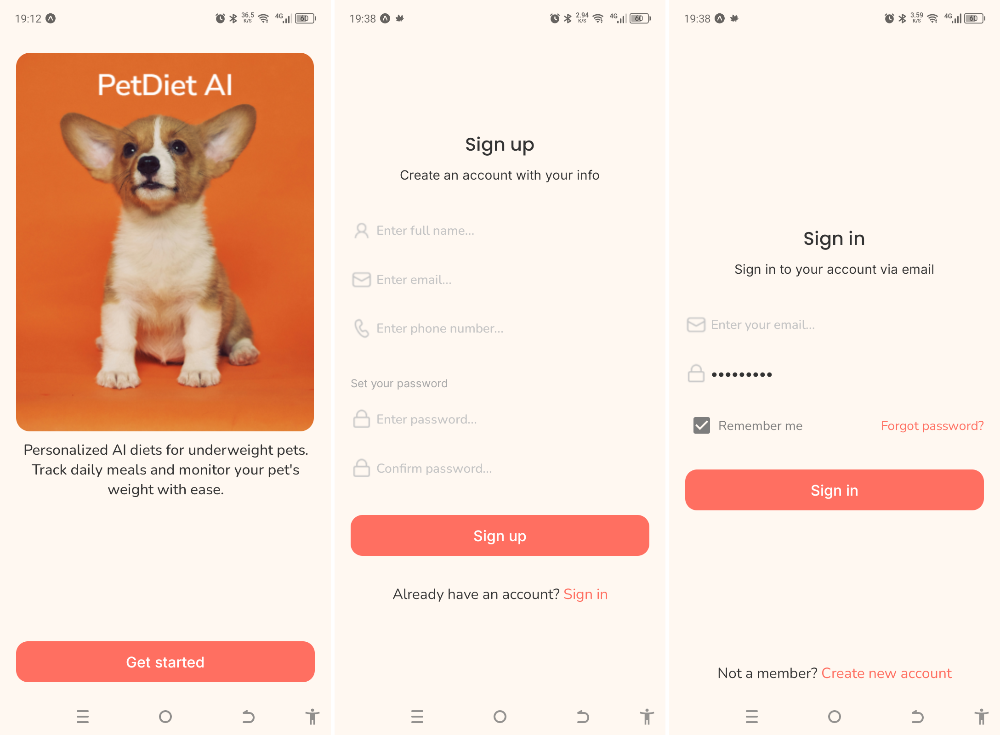
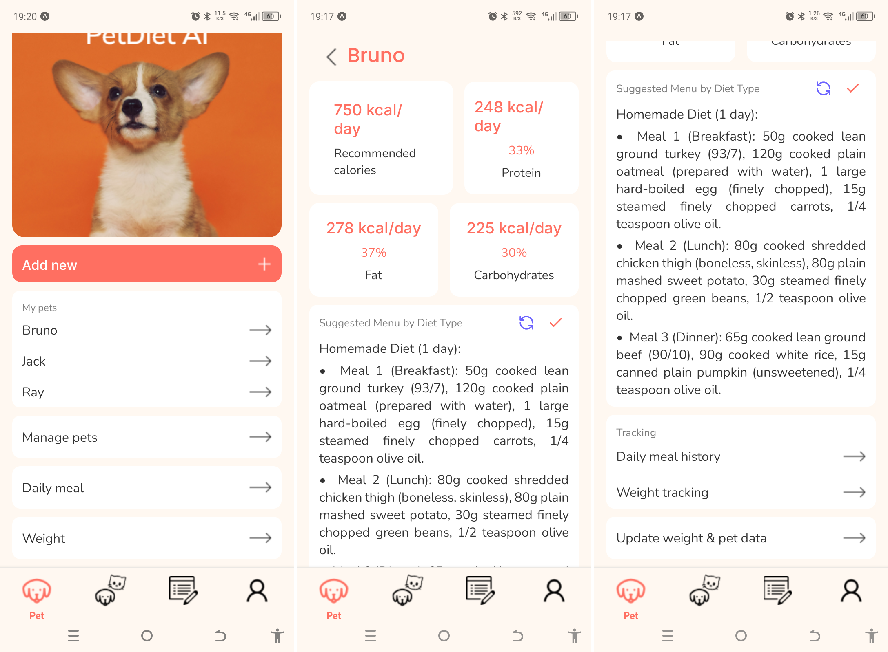
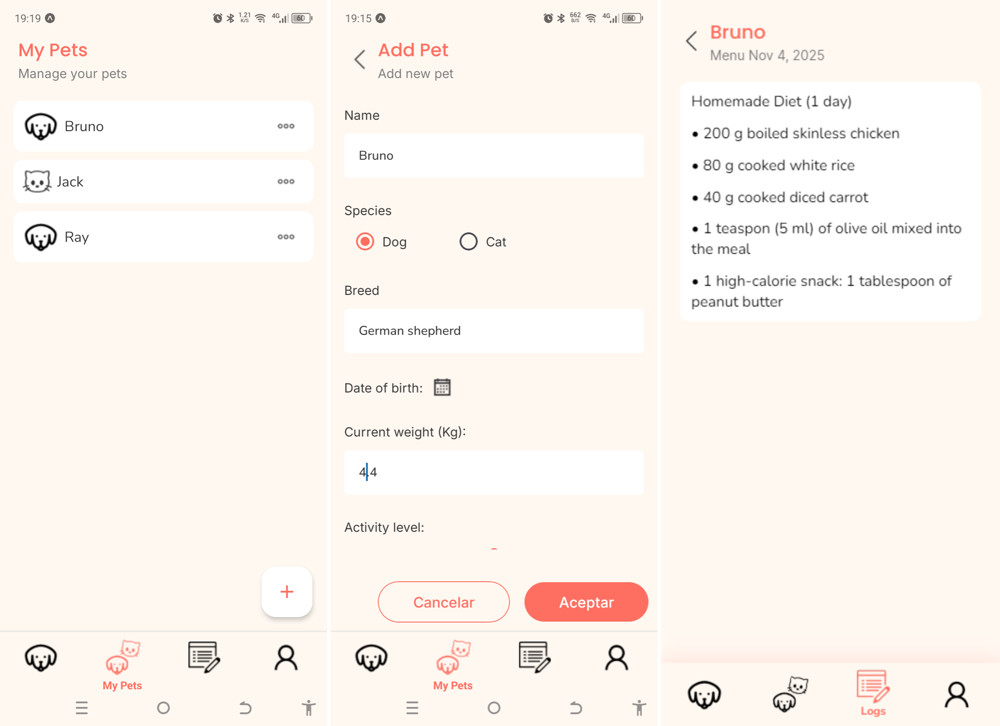
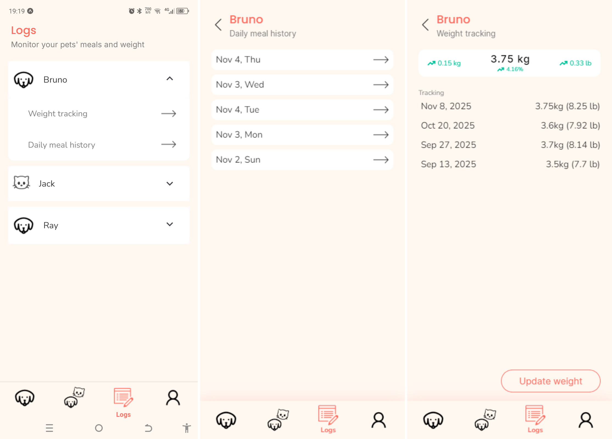

# PetDiet AI

PetDiet AI is a mobile application focused on generating personalized nutritional plans for underweight pets, designed to improve their body condition safely and progressively.

## ✨ Key Features
- **Complete pet management**: register pets, track history, and monitor progress.
- **AI-powered daily nutrition plans**: automatic generation tailored to each pet’s needs.
- **Menu history**: review previously generated plans.
- **Weight tracking**: monitor safe and gradual improvements.
- **REST API architecture**: seamless communication between backend and mobile app.

## 🛠️ Tech Stack
### Backend
- [NestJS](https://nestjs.com/)  
- [Prisma](https://www.prisma.io/)  

### Mobile App
- [React Native](https://reactnative.dev/)


## 🚀 Installation & Usage
```bash 
# Clone the repository
git clone https://github.com/Alvarez-Bermudez/Pet-Diet-AI.git
cd Pet-Diet-AI
```

### Backend
```bash
cd backend

# 1.Install dependencies
pnpm install

# 2.Run Prisma migrations
pnpm dlx prisma migrate dev

# 3.Start the server
pnpm start:dev
```
### Mobile App
```bash
# Open new terminal
cd frontend-mobile

# 1.Install dependencies
pnpm install

# 2.Start Expo server
pnpm start
```

## 🤝 Contributing
Contributions are welcome!  
Please open an issue or submit a pull request for suggestions and improvements.

## 📸 Screenshots




